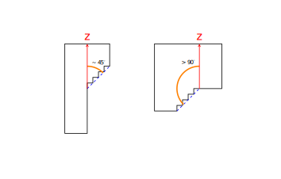

# 3D Printing Placer Assistant

## Overview

3D Printing Placer Assistant is a user-friendly tool designed to ease the 3D printing process by automating the tedious task of manual support placement. By accurately identifying overhanging parts in STL files (the task often failed by slicers such as Wanhao and Chitubox), this application not only saves time but also improves the printing success rate. It utilizes C++ for calculations and Python for a graphical user interface (WIP).

## Requirements and Dependencies

Before you get started with the 3D Printing Placer Assistant, ensure you have the following requirements met:

- **Python 3.6 or later**: The graphical user interface and some parts of the processing are implemented in Python.
- **Python reuirements**:  Install the required Python libraries using pip (pip install -r requirements.txt).
- **C++ Compiler**: The core logic for parsing STL files and identifying problematic regions is written in C++. This project utilizes g++ by default, but you may have to change the target compiler in the app.py.

## Features

- **Automatic Overhang Detection**: Quickly scans STL files to highlight all overhanging sections that may require supports.
- **Visualization**: Offers a visual representation of the STL file, with overhangs prominently marked, facilitating easy inspection and planning.
- **Cross-Platform Compatibility**: Works on multiple operating systems, ensuring wide accessibility.
- **Install and Run**: once you install all dependencies, you can write app.py.

## Getting Started

### What is Considered to Be an Overhang?

In the context of 3D printing, an overhang refers to any part of the model that extends beyond a certain angle relative to the vertical axis and lacks direct support from the layers below. The 3D Printing Placer Assistant specifically identifies two types of overhangs:

1. Angled Overhangs: This type involves parts of the model that are connected to the layer below but at an angle greater than 45 degrees. By analyzing consecutive slices, if the normal line drawn through the edges of contours forms an angle exceeding 45 degrees with the vertical, that portion is flagged as an overhang. These areas often need support structures to maintain print quality and integrity.

2. Isolated Regions: These are portions of a model that, when viewed in a sliced layer, do not connect directly to the layer below. This effectively means they are "floating" in mid-air, creating a practical overhang angle of more than 90 degrees. These regions require support to be printed successfully.

### Advanced Problematic Region Identification

Using overhang angles as a criteria for determining potentially problematic regions is problematic. It requires a lot of computations, meaning it is only viable when using GPUs. This is out of question in the scope of this project. That is the whole reason for the approach, implemented for the parser: the model is first turned into a graph of vertices and then every vertex, which lacks a neighboring vertex below it, is considered.